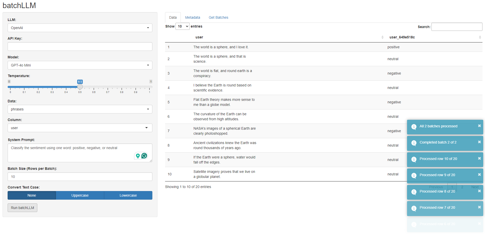

# batchLLM

The goal of batchLLM is to facilitate Large Language Model (LLM) operations on data frames in batches with local storage. Effortlessly loop across rows of a column and generate text completions on large datasets with minimal supervision.

The package currently supports OpenAI GPT and Anthropic Claude models, with built-in delays for API etiquette. The package addresses challenges in text processing by offering features such as saving batches and metadata in a locally stored log file and implementing a Shiny App Addin.

Use cases include sentiment analysis, thematic analysis, classification, labeling or tagging, and language translation. You can also compare the output of different LLMs.

## Installation

You can install batchLLM from GitHub using the `devtools` package:

``` r
# install.packages("devtools")
devtools::install_github("dylanpieper/batchLLM")
```

## Basic Usage

By default, batchGPT uses OpenAI's GPT-4o Mini model.

``` r
library(batchLLM) 

Sys.setenv(OPENAI_API_KEY = "...")

phrases <- data.frame(user = c("The world is a sphere, and I love it.", "The world is a sphere, and that is science.", "The world is flat, and round earth is a conspiracy."))

batchLLM(
  df_name = "phrases",
  col_name = "user",
  prompt = "Classify the sentiment using one word: positive, negative, or neutral"
)

print(phrases)

                                                 user user_7dd87525
1               The world is a sphere, and I love it.      positive
2         The world is a sphere, and that is science.       neutral
3 The world is flat, and round earth is a conspiracy.      negative
```

## **Features**

-   **Batching**: Applies the prompt to a specified number of rows at a time, with short delays within batches and longer delays between batches.

-   **Progress Resume**: Automatically resumes from the last completed step if the process is interrupted, ensuring continuity and saving resources.

-   **Hashing**: Generates unique hashes for column names and data frames, preventing mutation conflicts. Uses the `digest` function and `crc32c` algorithm by default.

-   **Metadata Storage**: Saves metadata in a local log file with a nested list structure (`batchLLM-log.rds`), ensuring easy retrieval and organization.

-   **Flexible Parameters**: Allows adjustment of parameters for data selection, LLM model configuration, batch size, retry attempts, log file name, case conversion, and hashing algorithm.

-   **Compatibility**: Supports any data frame or object that inherits from `data.frame`, ensuring broad applicability across different data types.

### Scraping Metadata

After processing multiple batches, you can use the `scrape_metadata()` function to return the metadata from `batchLLM-log.rds` into a single data frame. You may specific the name of a process column to return only the metadata from that batch (e.g., `scrape_metadata("user_7dd87525")`).

### Getting Batches

After processing multiple batches, you can use the `get_batches()` function to subset all of the generated output from `batchLLM-log.rds` into a single data frame (e.g., `get_batches("phrases_ddd071e0")`). Use the `scrape_metadata()` function to help you identify the hashed name of your data frame.

### Shiny Addin

You can use the `batchLLM_shiny()` Shiny Addin to quickly run batchLLM from the RStudio IDE. It includes interactive inputs and animated progress alert messages.



## Contributing

Contributions to batchLLM are welcome. Add a new LLM, or help expand the Shiny Addin. Please feel free to submit a pull request.
