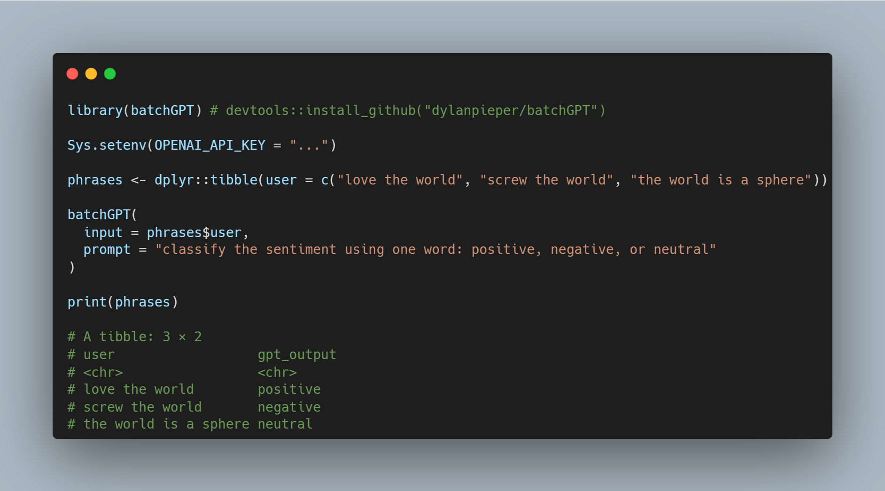

# batchGPT()

Use OpenAI's GPT model to conduct natural language tasks using rows from a column as the input. The **batching** feature is particularly useful for completing tasks on large datasets with little to no supervision.



```{r}
library(batchGPT) # devtools::install_github("dylanpieper/batchGPT")

Sys.setenv(OPENAI_API_KEY = "...")

phrases <- dplyr::tibble(user = c("love the world", "screw the world", "the world is a sphere"))

batchGPT(
  input = phrases$user,
  prompt = "classify the sentiment using one word: positive, negative, or neutral"
)

print(phrases)

# A tibble: 3 × 2
# user                  gpt_output
# <chr>                 <chr>
# love the world        positive
# screw the world       negative
# the world is a sphere neutral
```

**Future Improvements**

-   Accept piped data, for example:

```{r}
phrases |>
batchGPT(
  input = user,
  prompt = "classify the sentiment using one word: positive, negative, or neutral"
)
```
